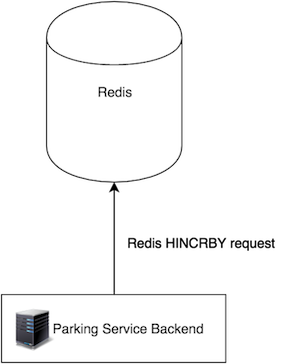

# CPP Parking Status Indicator (PSI) Backend
 
## What is the PSI Backend?
This repo holds all parking data moderation logic. It is a webserver that provides a REST interface to updating and reading all parking lot occupancy levels.

### Technology
Our webserver is built on the [Play! framework](https://www.playframework.com/). We chose this framework out of the dozens of technologies out there because it supports Java (which is nice since Cal Poly is a Java school), and because it is well suited to asynchronous highly-concurrent tasks using [Akka](http://akka.io/). The main advantage of Play for us is Akka's [Actor Model](http://doc.akka.io/docs/akka/2.4/general/actors.html)- which gives us an abstraction to hundreds of thousands of lightweight threads with independent state. We also use Play's built-in [Guice dependency injection](https://www.playframework.com/documentation/2.5.x/JavaDependencyInjection) framework. However, that's not to say it's perfect. Documentation for the newer actor-websocket model is [lacking](https://github.com/playframework/playframework/issues/5057), and Scala is more of a first class citizen in the framework than Java. 

Our webserver is also dependent upon [Redis](https://redis.io/) as a data store; all state update requests are passed on as [*HINCRBY*](https://redis.io/commands/hincrby) requests to Redis, and state queries are performed by [*HGETALL*](https://redis.io/commands/hgetall) requests to Redis. We designed the backend architecture with Redis in mind to ensure easy horizontal scalability.  
 

## Architecture

### Scalability

So how exactly do we achieve scalability?

One primary means is through horizontal scaling. The backend is designed to be stateless, so that we can create multiple backends on multiple servers, and load balance among them (using something like [Nginx](https://www.nginx.com/resources/wiki/)). Statelessness is achieved by shifting the storage of data to Redis. 
 
However, this poses a problem; if an Ingress/Egress monitor hits one backend server trying to update parking lot state, how do all other backend servers become aware of the change in state? Fortunately, Redis supports [notification](https://redis.io/topics/notifications) of key changes through a [Pub/Sub](https://redis.io/topics/pubsub) model. Basically, whenever one server updates the hashmap in Redis, all other servers get notified, and can then query for the updated state. Note: to enable notifications in Redis (which are disabled by default) the Redis' [`notify-keyspace-events` config option must be set to `AKE`](http://download.redis.io/redis-stable/redis.conf).
 
One question you might ask is: even if we increase the number of backend servers, doesn't the fact that we have a single Redis server mean we are bottlenecked? 

Not really. 

The main source of potential slowdown in our application is network requests to Redis. However, the number of requests made to Redis is a *linear function of the number of updates Redis receives* (the parking lot updates forwarded from the Ingress/Egress monitors), *not the number of client connections we have*. Since we cache the latest state in local memory, we don't hit Redis for every single new client connection. So how many updates should Redis be getting? We expect around 1-2 updates per minute, per Ingress/Egress monitor. Since there are ~30 parking lots, with let's say an arbitrary estimate of ~10 entrances per lot, we'll estimate 600 requests per minute. This is a far cry from [hundreds of thousands of requests Redis supports per second](https://redis.io/topics/benchmarks). Moreover, each connection between the client and the backend is mediated through an Actor, which is highly concurrent, and has an extremely low memory footprint.

So even if we have all 30,000 people at Cal Poly connect to 3-4 webservers, we should still scale fine, since Redis will still get approximately the same number of requests. By dividing the data layer and network layer, we can scale up our backends as necessary for more traffic w/o increasing load on Redis.


### Diagram

Let's follow the flow of data.


 The Ingress/Egress monitors send an Http Post to a backend proxied by the load balancer.
  
  
  


The backend server parses the json payload of the Http Post, and sends an HINCRBY request to Redis, to update the appropriate parking lot's data.


Redis will update its parking lot data, and publish a notification saying that its data has been modified. All of the backend servers are listening to these notifications.


All backends query Redis for the updated state, and cache that state locally.


All backends will push their updated state to any clients connected via websocket.
 
 


### Implementation

Down to the nitty gritty. How does the code work?

All of our endpoints are defined in `<project-root>/conf/routes`. Each endpoint and http method gets assigned to a method in `ParkingController.java`.

Upon instantiation, `ParkingController.java` is received an already instantiated `ActorRef` to a ClientManager. More on this Actor below. `ParkingController.java` also immediately uses a background thread to listen for Redis updates using `redisSubscriber`. When an update request comes into ParkingController, the `update` method simply performs a HINCRBY request to Redis. When a get request comes into ParkingController, the `status` method asks the ClientManager actor for the latest status.  
     
The ClientManager Actor is responsible for overseeing all client websocket actors. We can use this actor to tell all the client websocket Actors to send json messages back to  the clients. This actor also queries Redis for updated state whenever it receives a message from the background Redis subscriber thread.

So let's see how the data flows from beginning to the end.

An Ingress/Egress monitor posts to `/lots`, with a json payload describing which lot, and how many of cars entered/left. ParkingController's update method sends `HINCRBY` to Redis. Redis is configured to publish any updates on its keys, so it creates a message on the channel `__keyspace@0__:<mykey>`. All backend servers (including the one sending the `HINCRBY` request) are subscribed to Redis' notifications, causing `RedisSubscriber.java`'s `onMessage` callback to be invoked. `RedisSubscriber`'s runnable is constantly listening for Redis notifications on a background thread, and when it receives one, it sends a message to the ClientManager actor, informing that new state is available. ClientManager receives the message in its inbox, and queries Redis to refresh its local state. Any queries by clients about latest state get resolved by ClientManager.     

 
    


## API

### Retrieve Lot Data

*  **URL:** /lots

*  **Method:** GET 

*  **URL Params:** Required: None

*  **Success Response**:

    *  **Code:** 200
    *  **Content-Type:** application/json
    *  **Response Body:**
    ```json
    {
       "A":{
          "name":"A",
          "numParked":0,
          "maxCapacity":100
       },
       "B":{
          "name":"B",
          "numParked":0,
          "maxCapacity":100
       },
       "G":{
          "name":"G",
          "numParked":0,
          "maxCapacity":100
       },
       "H":{
          "name":"H",
          "numParked":0,
          "maxCapacity":100
       },
       "I":{
          "name":"I",
          "numParked":0,
          "maxCapacity":100
       },
       "Unpaved Overflow Lot":{
          "name":"Unpaved Overflow Lot",
          "numParked":0,
          "maxCapacity":100
       },
       "J":{
          "name":"J",
          "numParked":0,
          "maxCapacity":100
       },
       "E1":{
          "name":"E1",
          "numParked":0,
          "maxCapacity":100
       },
       "L":{
          "name":"L",
          "numParked":0,
          "maxCapacity":100
       },
       "E2":{
          "name":"E2",
          "numParked":0,
          "maxCapacity":100
       },
       "M":{
          "name":"M",
          "numParked":0,
          "maxCapacity":100
       },
       "Overflow Parking Lot":{
          "name":"Overflow Parking Lot",
          "numParked":0,
          "maxCapacity":100
       },
       "O":{
          "name":"O",
          "numParked":0,
          "maxCapacity":100
       },
       "P":{
          "name":"P",
          "numParked":0,
          "maxCapacity":100
       },
       "Q":{
          "name":"Q",
          "numParked":0,
          "maxCapacity":100
       },
       "R":{
          "name":"R",
          "numParked":0,
          "maxCapacity":100
       },
       "U":{
          "name":"U",
          "numParked":0,
          "maxCapacity":100
       },
       "Parking Structure":{
          "name":"Parking Structure",
          "numParked":0,
          "maxCapacity":100
       },
       "F10":{
          "name":"F10",
          "numParked":0,
          "maxCapacity":100
       },
       "F1":{
          "name":"F1",
          "numParked":0,
          "maxCapacity":100
       },
       "F2":{
          "name":"F2",
          "numParked":0,
          "maxCapacity":100
       },
       "F3":{
          "name":"F3",
          "numParked":0,
          "maxCapacity":100
       },
       "F4":{
          "name":"F4",
          "numParked":0,
          "maxCapacity":100
       },
       "F5":{
          "name":"F5",
          "numParked":0,
          "maxCapacity":100
       },
       "F8":{
          "name":"F8",
          "numParked":0,
          "maxCapacity":100
       },
       "F9":{
          "name":"F9",
          "numParked":0,
          "maxCapacity":100
       }
    }
    ```
       
*  **Sample Call:**

    ```bash
    curl localhost:9000/lots
    ```

*  **Notes:**
We can change this endpoint to return a list of all parking lots instead of a map.**Do not poll this endpoint to continuously update your state. Please use the websocket endpoint instead.**
  

### Update Lot Data 
*  **URL:** /lots

*  **Method:** POST 

*  **Data Params:** 
    Required: json body in http payload
    ```json
    {
     "name": "<nameOfParkingLot>",
     "diff": 10
    }
    ```
    
    *  Note: `<nameOfParkingLot>` must be one of the names featured in the JSON response above, (i.e. "F10", "Overflow Parking Lot", etc). Also, diff is a (possibly negative) integer corresponding to the amount of cars to increment in the lot. 

*  **Success Response:**
    *  **Code:** 200
    *  **Response Body:** none

*  **Sample Call:**

    ```bash
    curl --header "Content-type: application/json" --request POST --data '{"name": "A", "diff": 20}' http://localhost:9000/lots
    ```

### We will update with further endpoints


## Set Up For Development
This project uses activator. To install activator, follow the instructions [here](https://www.playframework.com/documentation/2.5.x/Installing#Installing-Play-with-Activator), or, if you're on a Mac, run `brew install typesafe-activator`.

In order to work on this repo in Intellij, you should install the SBT and Scala plugins. Clone the project, and choose 'Import from Existing sources', with SBT option. Intellij will automatically download any dependencies needed (stored in build.sbt), and index all files.
 
This project requires redis in order to run. To run locally, we suggest installing docker, and running `docker run -p 6379:6379 redis redis-server --notify-keyspace-events AKE`. In addition, you have to change `<project-root>/conf/application.conf`'s `redis.host` value from `"redis"` to `"localhost"`.

Finally, to run the project from the command line, execute ```activator compile``` from the project root. Then execute `activator run`. To see if everything works, go to `http://localhost:9000/lots` in your browser. You should see json corresponding to parking lot status. More detailed instructions can be found on the Play! framework website.

We have also created a Docker image for ease of deployment. To run the entire application (redis and backend), make sure you have docker installed, and execute `make run` from the project root. This will use docker-compose to launch a Redis container and the backend container.   